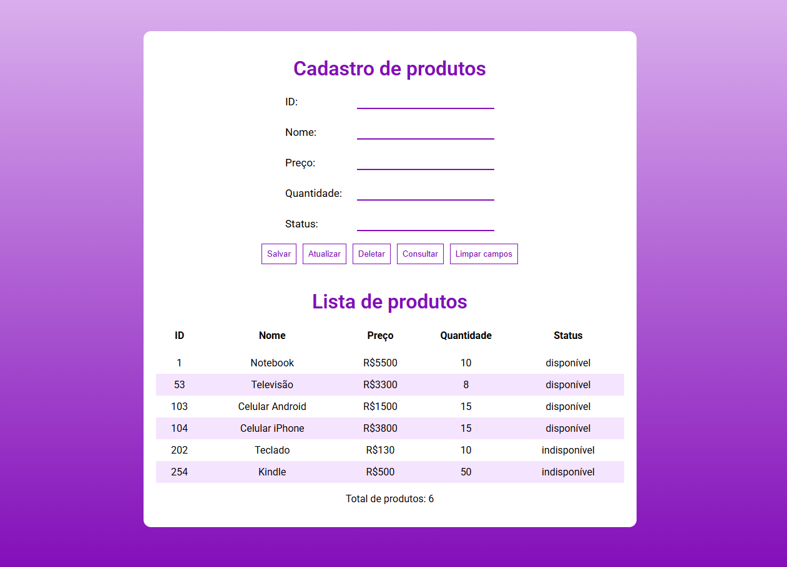
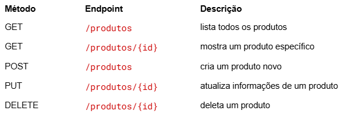

# Sistema de cadastro de produtos

## Descrição
O sistema de cadstro de produtos é uma aplicação web completa voltada para o gerenciamento de produtos, baseada em uma única entidade principal: produto. A aplicação permite realizar todas as operações CRUD de forma integrada entre frontend e backend.

## Funcionalidades
- Cadastrar novos produtos
- Atualizar informações de produtos
- Deletar produtos
- Listar todos os produtos
- Validação de dados

## Tecnologias utilizadas
1. Java
2. Spring Boot
3. MySQL
4. Spring Data JPA + Hibernate
5. JavaScript
6. HTML 
7. CSS

## Interface

    

## Endpoints da API

    

## Como executar o projeto
### Backend:
1. Clone o repositório: `git clone https://github.com/sapicenn/projeto-produtos-com-springboot`
2. Execute o programa
### Frontend:
3. Abra o arquivo HTML no seu navegador ou rode com uma extensão como extensão Live Server

## Autor
Desenvolvido por Sarah Picenni de Oliveira